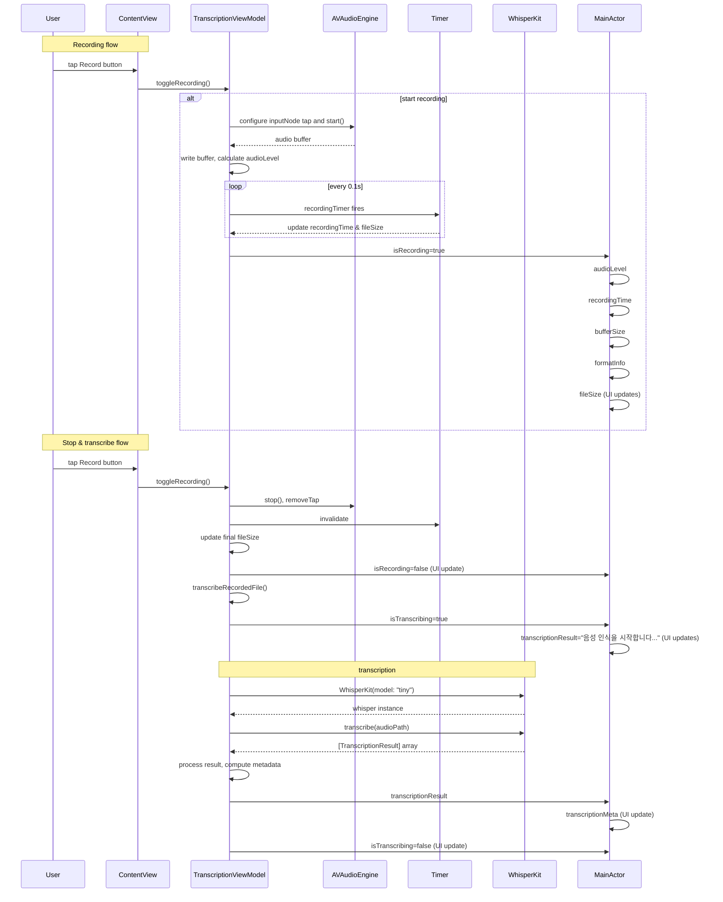

```mermaid
sequenceDiagram
    participant User
    participant ContentView
    participant ViewModel as TranscriptionViewModel
    participant AVEngine as AVAudioEngine
    participant Timer
    participant WhisperKit
    participant MainActor

    Note over User,ContentView: Recording flow
    User->>ContentView: tap Record button
    ContentView->>ViewModel: toggleRecording()
    alt start recording
        ViewModel->>AVEngine: configure inputNode tap and start()
        AVEngine-->>ViewModel: audio buffer
        ViewModel->>ViewModel: write buffer, calculate audioLevel
        loop every 0.1s
            ViewModel->>Timer: recordingTimer fires
            Timer-->>ViewModel: update recordingTime & fileSize
        end
        ViewModel->>MainActor: isRecording=true
        MainActor->>MainActor: audioLevel
        MainActor->>MainActor: recordingTime
        MainActor->>MainActor: bufferSize
        MainActor->>MainActor: formatInfo
        MainActor->>MainActor: fileSize (UI updates)
    end

    Note over User,ContentView: Stop & transcribe flow
    User->>ContentView: tap Record button
    ContentView->>ViewModel: toggleRecording()
    ViewModel->>AVEngine: stop(), removeTap
    ViewModel->>Timer: invalidate
    ViewModel->>ViewModel: update final fileSize
    ViewModel->>MainActor: isRecording=false (UI update)
    ViewModel->>ViewModel: transcribeRecordedFile()
    ViewModel->>MainActor: isTranscribing=true
    MainActor->>MainActor: transcriptionResult="음성 인식을 시작합니다..." (UI updates)

    Note over ViewModel,WhisperKit: transcription
    ViewModel->>WhisperKit: WhisperKit(model: "tiny")
    WhisperKit-->>ViewModel: whisper instance
    ViewModel->>WhisperKit: transcribe(audioPath)
    WhisperKit-->>ViewModel: [TranscriptionResult] array
    ViewModel->>ViewModel: process result, compute metadata
    ViewModel->>MainActor: transcriptionResult
    MainActor->>MainActor: transcriptionMeta (UI update)
    ViewModel->>MainActor: isTranscribing=false (UI update)
```
